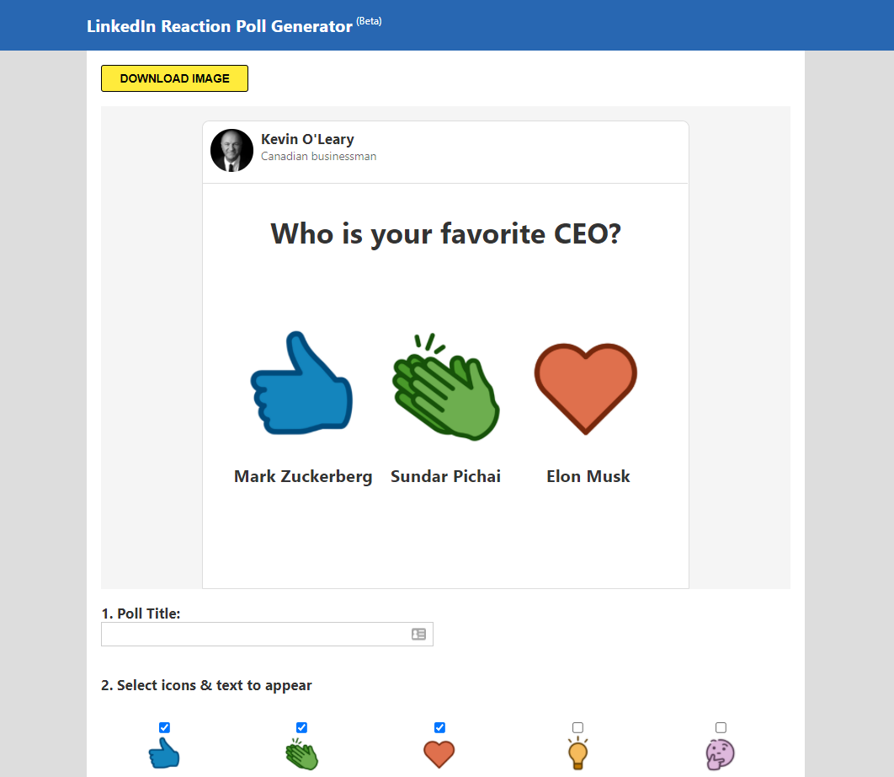
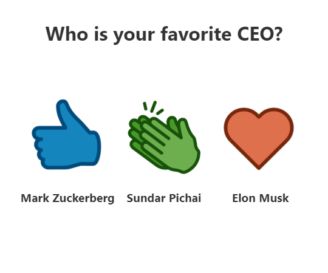

# LinkedIn Reaction Poll Generator(Beta)

Reactions increase the reach of a post on LinkedIn similar to what happens on every other social media platform. Because of this, something I call "reaction polls" have become really popular as a growth hack. Instead of running a regular LinkedIn poll, which is frankly pretty jank and constrained to 4 options, you can have users react to your post to vote on the option they want, creating a much richer experience that also nets you the poster a bunch of free engagement. If you don't know what I'm talking about, here's an example of one of these reaction polls:

This project is an implementation to the [idea here](https://github.com/Gear61/Software-Project-Ideas/blob/main/LinkedIn%20Reaction%20Poll%20Generator.md) by Alex Chiou.

Using the app will output an image that is 540px wide for Linkedin feed:

## Running it Locally:

Clone this project to your computer and cd into the project. Run `yarn install` (you can also do `npm install`, but yarn seems to download everything quickly, since we already have a lock file).

Run this project by typing `yarn start` and visiting `localhost:3000` on your computer.

Edit the `App.js` file, it's a single file with all the HTML and JS for the time being.

Edit the `App.css` file to style the app.

## MVP Requirements (implemented)

- Show an initially blank image with the 5 LinkedIn reactions. This will be the "canvas" that lets users know what their reaction poll currently looks like.
- User can type in what question they want to poll to ask. The "canvas" should update in real-time.
- User can type in the text they want to show up for each of the reactions. The "canvas" should update in real-time.
- User can click a button and download the filled in template image when they are done.

## How it is done?

Using `<canvas>` API it's possible to draw text over images like we see meme generators. But implementing the raw API is cumbersome. Fortunately there a are bunch of open source tools that let us make it easily. I used the [Dom To Image](https://github.com/tsayen/dom-to-image) package to handle the image generation. I was surprised it created the image without any visible inconsistancies.

I created a preview or demo area where we will put all the text and icons. When we click **download** domtoimage will take that entire element by the class and offer to save. The save function is achieved using another package called [File Saver](https://github.com/eligrey/FileSaver.js/)

The main interactivity is done using ReactJS with local state.

## Next Steps

- Add google analytics for page views and custom events for image download button clicks.
- Add the 6th remaining icon, Support.
- Add github star button.
- Add option for image uploads for each votes.
- Variable text size for legibility.
- Better layout so we can see the text while editing.
- Need to make this app usable on the mobile. Right now it's not very friendly, because it's best fit as a desktop app.
- Implement accessibility.
- Browser testing.
- Need to fix bugs after user testing.
- Want to implement high-resolution image outputs. At least 800-1200px.
- A reset button to clear all the text.
- Refactor the code.
- Save the last image data into the user's browser.
- Implement image loading skeleton for layout shifts
- What happenes when we add a long title and long option names? Currently when we enter a long title, it will not add `.png` at the end of the file when saving the file. So we might wanna trim the file name when saving.
- Add option for grid icon layout.
- Other extensions mentioned [here](https://github.com/Gear61/Software-Project-Ideas/blob/main/LinkedIn%20Reaction%20Poll%20Generator.md#possible-extensions)
